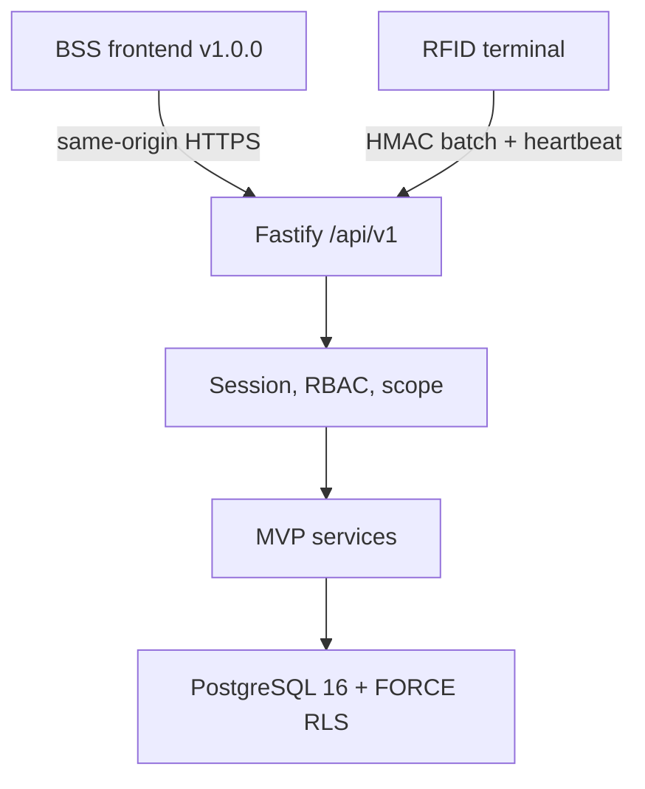
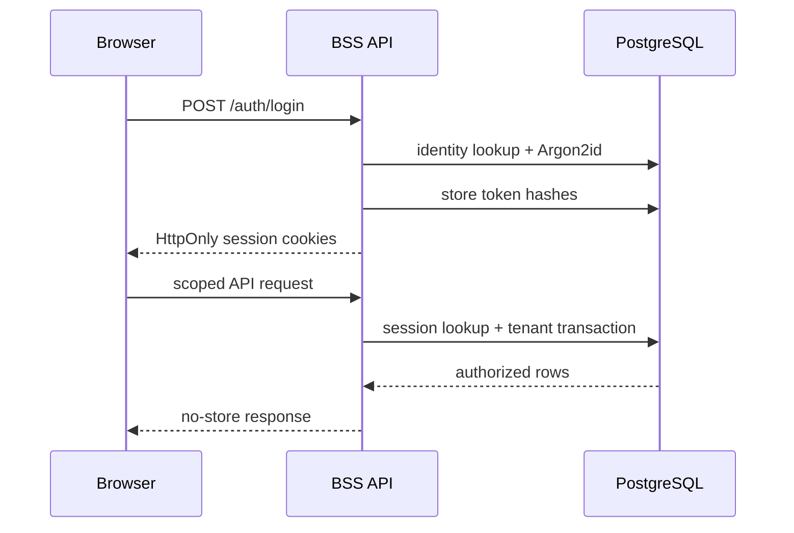

# BSS Backend Architecture – MVP Faza B

| Odluka | Vrijednost |
| --- | --- |
| Stil | modularni monolit |
| Runtime | Node.js 22+ / TypeScript / Fastify 5 |
| API | REST `/api/v1`, OpenAPI `1.1.0` |
| Baza | PostgreSQL 16, eksplicitni SQL i `pg` |
| Tenant model | shared schema, `organization_id`, FORCE RLS |
| Sesije | opaque access/refresh tokeni u sigurnim kolačićima |
| Deploy | jedan Node servis za frontend + API; migrator je zaseban korak |

## Sustav

Modularni monolit zadržava attendance, odluke, audit i izvještaj u jednoj ACID granici. Mikroservisi, queue i objektna pohrana nemaju opravdanje za početni MVP i ostaju zamjenjivi adapteri za kasnije skaliranje.

## Moduli

| Modul | Odgovornost |
| --- | --- |
| `config` | fail-fast environment i produkcijske sigurnosne zabrane |
| `http` | JSON Schema, Origin zaštita, error envelope, cache/security headeri |
| `security` | Argon2id, tokeni, refresh rotacija, RBAC, RFID HMAC, device HMAC/AES-GCM |
| `db` | pool, tenant transakcija, migracije, bootstrap |
| `PgAuthService` | login, invitation accept, session resolve/rotate/logout |
| `PgPhaseAService` | organizacija, workforce, RFID, fond, preview, dashboard |
| `PgMvpService` | evidencija, odluke, terminal ingest, audit i izvozi |
| `reports` | CSV, XLSX i PDF iz jedinstvenog preview dataseta |
| `src/adapters/api*` | role-aware frontend hidratacija i stvarne HTTP mutacije |

## Tenant i transakcija

Provjereni `ActorContext` sadrži `organizationId`, `userId`, ulogu, odjele, vlastiti `workerId` i session ID. Za poslovnu operaciju:

1. otvara se transakcija;
2. `SET LOCAL` postavlja tenant, actor i request ID;
3. RLS ograničava sve tablice;
4. service dodaje department/self scope;
5. mutacija, revizija i audit završavaju istim commitom ili rollbackom.

Security-definer lookup funkcije koriste se samo prije tenant konteksta za login, session, refresh, invitation i terminal credential. Imaju fiksni `search_path`, RLS isključen samo unutar funkcije i eksplicitne runtime grantove.

## Sesijski protokol

Refresh se rotira jednom. Ponovna uporaba rotiranog tokena opoziva aktivne sesije korisnika. Blokirani korisnik ili tenant ne prolazi lookup.

## Terminalski ingest

Terminal dobiva jednokratnu vjerodajnicu pri pairingu; backend čuva hash i AES-256-GCM ciphertext. Svaki batch/heartbeat nosi device ID, timestamp, nonce i HMAC-SHA-256 canonical request potpis.

Batch se obrađuje serijski po slijedu:

- dupli `deviceEventId` vraća `duplicate`;
- sequence manji ili jednak server cursoru vraća `SEQUENCE_OUT_OF_ORDER`;
- nepoznata/blokirana kartica vraća odbijeni raw događaj;
- prijava stvara dan sa snapshotom smjene;
- odjava računa minute, ali odbija negativno ili dulje od 16 sati;
- raw događaj, sync read model i audit su append-only.

Heartbeat ažurira dostupnost i dijagnostiku, ali ne potvrđuje offline red i ne pomiče event cursor.

## Godišnji i korekcije

Pending i approved godišnji rezerviraju fond. Radni dani računaju se bez vikenda i organizacijskih blagdana. Worker row lock serijalizira konkurentne zahtjeve. Odluka zahtijeva aktualnu reviziju i manager scope.

Korekcija sprema before/requested snapshot. Odobrenje zaključava zahtjev i izvedeni `attendance_day`, provjerava mjesečni lock, mijenja samo izvedeni zapis i dodaje audit. `attendance_events` ostaje nepromijenjen.

## Izvještaji

Preview i izvoz koriste isti query servis i isti `datasetVersion`. CSV je UTF-8 BOM + točka-zarez i neutralizira formule. XLSX ima poslovni naslov, filter, frozen header, stilove, hrvatske znakove i kontrolne zbrojeve. PDF koristi ugrađeni Noto Sans i tablični landscape prikaz.

Artefakt, MIME, filename i SHA-256 spremaju se u `report_exports` na 24 sata. To je jednostavan MVP adapter; servis se kasnije može prebaciti na private object storage bez promjene HTTP ugovora.

## Frontend integracija

Fastify može posluživati `dist/` preko `FRONTEND_ROOT`; relativni put se pretvara u apsolutni. SPA i API tada su na istom originu. API adapter:

- pokušava `/me`, a zatim prikazuje login ako nema sesije;
- hidrira samo resurse dopuštene ulozi;
- mapira UUID-e u prikazne identifikatore bez spremanja poslovnog stanja lokalno;
- šalje `If-Match` za konkurentne mutacije;
- na 401 pokušava jednu refresh rotaciju;
- preuzima izvještaj iz privatne API rute.

Service worker cacheira samo shell/brand assete. Navigacija je network-first/no-store, a `/api/` uvijek ide izravno na mrežu.

## Migracije i deploy

`001`–`007` su checksumirane i advisory-lockane. Deploy redoslijed je: backup/recovery point, forward migracije, bootstrap samo za novu instalaciju, aplikacija, readiness/smoke. Runtime i migrator ne smiju biti ista DB uloga u produkciji.

Cloudflare Pages može prikazati samo statički shell. Funkcionalni MVP treba Node/Fastify hosting i PostgreSQL; produkcijska domena se usmjerava na taj same-origin servis ili siguran reverse proxy.

## Namjerne MVP granice

- jedna zadana smjena po radniku, bez višenedjeljnog rostera;
- organizacija se stvara kontrolnim bootstrapom, bez self-service brisanja;
- sinkroni export do 100.000 redaka, bez queuea;
- PostgreSQL bytea storage 24 sata, bez objektnog storagea;
- ručna dostava invitation URL-a, bez e-mail providera;
- bez MFA/SSO/payroll/GPS/biometrije/ERP-a.
