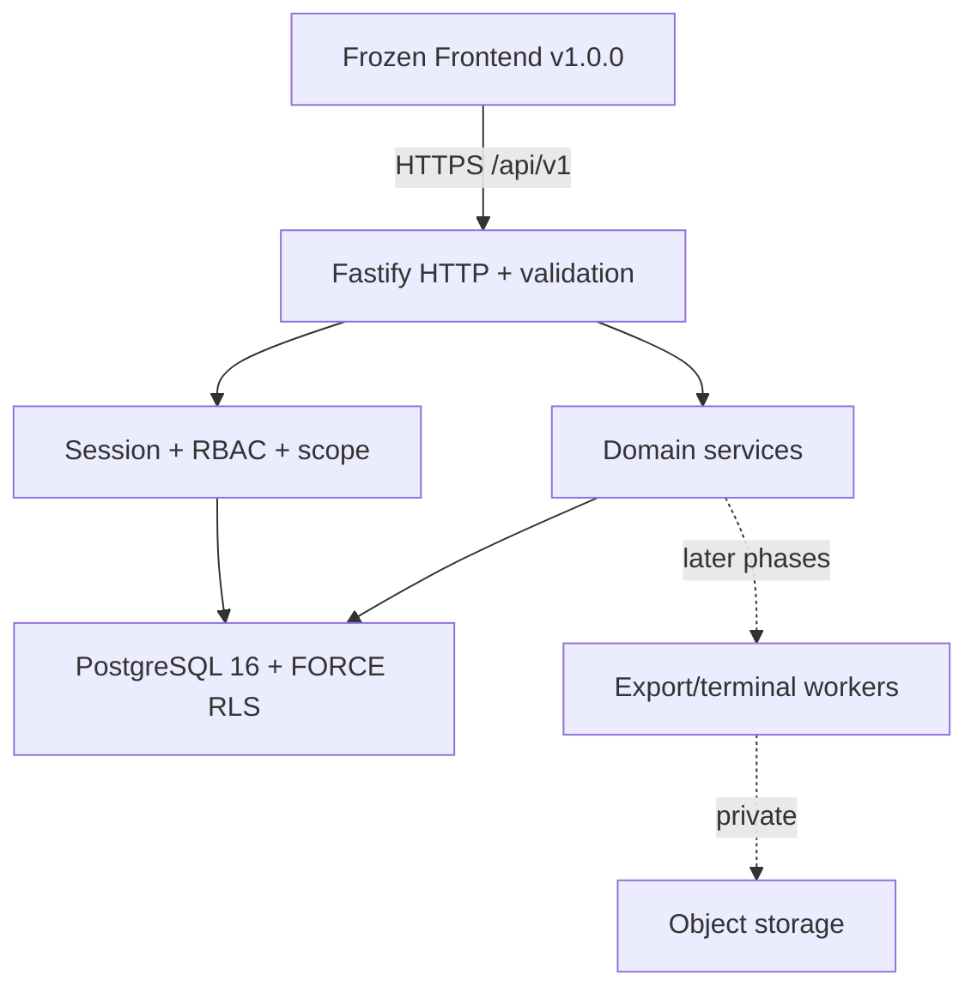
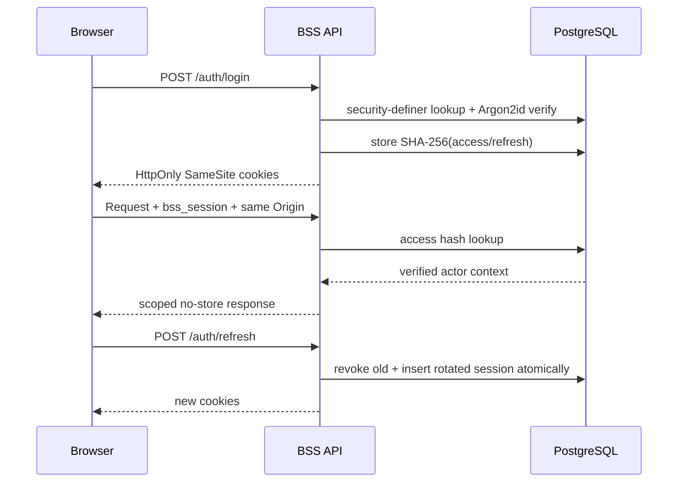

# BSS Backend Architecture – MVP Faza A

| Odluka | Vrijednost |
| --- | --- |
| Stil | modularni monolit |
| Runtime | Node.js 22 LTS + TypeScript 5.9 |
| HTTP | Fastify 5, REST `/api/v1` |
| Baza | PostgreSQL 16, eksplicitni SQL + `pg` |
| Tenant model | shared DB/schema + obvezni `organization_id` + FORCE RLS |
| Autentikacija | opaque rotirajuće sesije u sigurnim kolačićima |
| Deploy jedinica | jedan API servis; migracije su zaseban deployment korak |

## 1. Zašto modularni monolit i Fastify

MVP ima snažno povezane transakcije: attendance, korekcija, audit, lock mjeseca i izvještaj moraju koristiti isti izvor istine. Mikroservisi bi u ovoj fazi dodali distribuirane transakcije i operativni trošak bez poslovne koristi. Modularni monolit daje jasne domenske granice, ali jednu ACID transakciju i jednu shemu migracija.

Fastify je odabran jer je mali, eksplicitno sastavljiv, dobro podržava JSON Schema validaciju, kontrolirano logiranje i testiranje bez mrežnog porta. NestJS bi bio opravdan tek ako veličina tima i broj odvojenih modula narastu dovoljno da decoratorski framework smanji ukupnu složenost.

Izravni `pg`/SQL odabran je umjesto ORM-a kako bi RLS, tenant transakcija, složeni FK-ovi, locking i audit bili vidljivi i provjerljivi. Repository/service su jedina mjesta koja smiju sadržavati SQL.

## 2. Granice sustava



Frontend se ne autorizira sam. HTTP sloj mapira ugovor, security sloj stvara provjereni actor context, a service/repository ponavlja data scope u SQL-u. Objektna pohrana i queue ostaju adapteri kasnijih faza; ne uvode se u Fazu A prije potrebe.

## 3. Moduli

| Modul | Faza A | Odgovornost |
| --- | --- | --- |
| `config` | da | fail-fast validacija environmenta; produkcija samo HTTPS/secure cookie |
| `http` | da | OpenAPI rute, request ID, validacija, Problem envelope, no-store |
| `security` | da | Argon2id, token hash, refresh rotacija, RBAC, Origin zaštita |
| `db` | da | pool, tenant transakcija, migracije/checksum/advisory lock |
| `identity` | da | login, `/me`, sesije, korisnici i scope odjela |
| `organization/workforce` | da | organizacija, odjeli, radnici, smjene, blagdani, kartica block |
| `attendance/terminal` | samo schema | raw događaji, idempotencija, izvedeni dan i heartbeat u Fazi B/B5 |
| `leave/corrections` | samo schema | zahtjevi i atomske odluke u Fazi C/B3 |
| `reporting/audit` | schema + audit zapisi mutacija A | izvozi i čitanje audita u B4 |

## 4. Tenant isolation

Svaki autentificirani zahtjev dobiva nepromjenjivi `ActorContext`:

```text
organizationId, userId, role, departmentIds, selfWorkerId, sessionId
```

Vrijednosti dolaze isključivo iz hashirane session lookup funkcije. Za svaki repository poziv:

1. `BEGIN`;
2. `set_config('bss.organization_id', verifiedOrganizationId, true)`;
3. postavljanje actor/request metapodataka;
4. SQL s role/department/self filtrom;
5. `COMMIT` ili potpuni `ROLLBACK`.

RLS policy dopušta redak samo kada je `row.organization_id = bss_current_organization_id()`. `FORCE RLS` vrijedi i za ownera tablice; security-definer funkcije služe samo za pre-login/session lookup, imaju fiksni `search_path` i runtime dobiva execute samo na izričito dopuštene funkcije.

Kompozitni FK dodatno jamči da povezani resursi pripadaju istom tenantu. UUID je nepredvidiv identifikator, ali nije autorizacija.

## 5. RBAC i data scope

RBAC ima dvije provjere:

- resource/action matrica (`read`/`write`);
- data scope (`organization`, dodijeljeni `departmentIds`, ili vlastiti `workerId`).

Administrator je organization-wide. Voditelj ima samo dodijeljene odjele. Radnik ima isključivo vlastiti zapis i vlastite tokove. Knjigovodstvo je read/report-only i nema mutacije master ili attendance podataka. Negativni testovi su obvezniji od frontend navigacijskih pravila.

## 6. Sesijski protokol



Access token traje 15 minuta, refresh 30 dana. Logout opoziva server-side sesiju. Refresh token se koristi jednom; reuse pokreće opoziv aktivnih sesija. IP i user-agent pohranjuju se samo kao hash za sigurnosnu korelaciju.

MVP e-mail je globalno jedinstven jer postojeći login body nema tenant selector. To nije cross-tenant lookup iz frontenda: security-definer funkcija vraća točno jedan identitet, a zatim se sve odvija unutar njegovog tenant konteksta.

## 7. Model korekcija i audita

Raw terminal event je dokaz i nikad se ne mijenja. `attendance_day` je izvedeni poslovni prikaz. `correction_request` čuva snapshot prije promjene, tražene vrijednosti, razlog, stanje i odluku. Odobrenje se provodi kao zaključana ACID transakcija i stvara append-only audit.

Audit događaj sadrži tenant, tip/ID/ulogu actora, radnju, entitet, before/after JSON, vrijeme, `requestId` i minimalne metapodatke. Tajne, lozinke, UID kartice i session tokeni nikad se ne auditiraju u čistom obliku.

## 8. Migracije i kompatibilnost

Migracije `001`–`005` odvajaju foundation, workforce, identity, operational model i RLS. Svaka ima development `down`, ali produkcijski rollback je aplikacijski rollback uz kompatibilnu forward migraciju. Pravila:

- nikad mijenjati checksum primijenjene migracije;
- prvo dodati nullable/kompatibilnu strukturu, zatim backfill, pa tek u zasebnom izdanju ograničiti;
- aplikacija N i N-1 moraju raditi tijekom rolling deploya;
- destruktivna promjena zahtijeva backup/recovery point i odobrenje;
- migrator i runtime nisu ista DB uloga.

## 9. API i konkurentnost

- OpenAPI je jedini HTTP ugovor; Phase A implementira 22 postojeće operacije.
- JSON je `camelCase`; SQL je `snake_case` i mapira se u service sloju.
- Body odbija dodatna polja; klijentski `organizationId` nije tiho prihvaćen.
- Mutacije koriste `If-Match` i neprozirnu `revision`; stale zapis vraća `409`.
- Error envelope je stabilan: `code`, sigurna `message`, `requestId`, opcionalni `fieldErrors`.
- Privatni odgovor je `no-store`; service worker ga ne smije cacheirati.
- Paginacija koristi neprozirni cursor i maksimalno 200 redaka.

## 10. Observability i tajne

Fastify generira/prihvaća request ID, strukturirano logira i redaktira cookie/authorization/set-cookie. Produkcijski minimum prije pilota:

- error rate/latency po operation ID-u;
- broj login rate-limit/refresh-reuse događaja;
- DB pool saturation i migration status;
- kasnije: terminal last-seen/queue/clock offset, rejected event i export queue metrike.

DATABASE URL, cookie/device tajne i storage ključevi idu u platform secret store. Nema tajni u frontendu, GitHubu, Cloudflare Pages public envu ili logovima.

## 11. Faza A – isporučeno i granica

Isporučeno:

- pet migracijskih koraka i puni relacijski MVP model;
- FORCE RLS + tenant FK-ovi;
- login/refresh/logout/`me`, Argon2id i rotirajuće sesije;
- RBAC matrica i manager department scope;
- REST za organizaciju, odjele, blagdane, korisnike, radnike, smjene i RFID block;
- optimistic concurrency i audit mutacija;
- unit, HTTP contract i stvarni PostgreSQL integration test;
- GitHub quality gate s PostgreSQL 16 servisom;
- backup/restore/rollback runbook.

Nije isporučeno u Fazi A: povezivanje frontenda, attendance/terminal processing, leave/correction odluke, export worker, object storage, MFA UX i produkcijski deploy. To je namjerna fazna granica, ne skriveni nedovršeni frontend posao.

## 12. Sljedeći gate

Nakon pregleda i odobrenja Faze A slijedi read-only attendance vertikala. Prije svake kasnije vertikale mora se verzionirati samo relevantna praznina iz `BACKEND_READINESS_REPORT.md`; ne smije se paralelno širiti UX/UI ili poslovni opseg.
