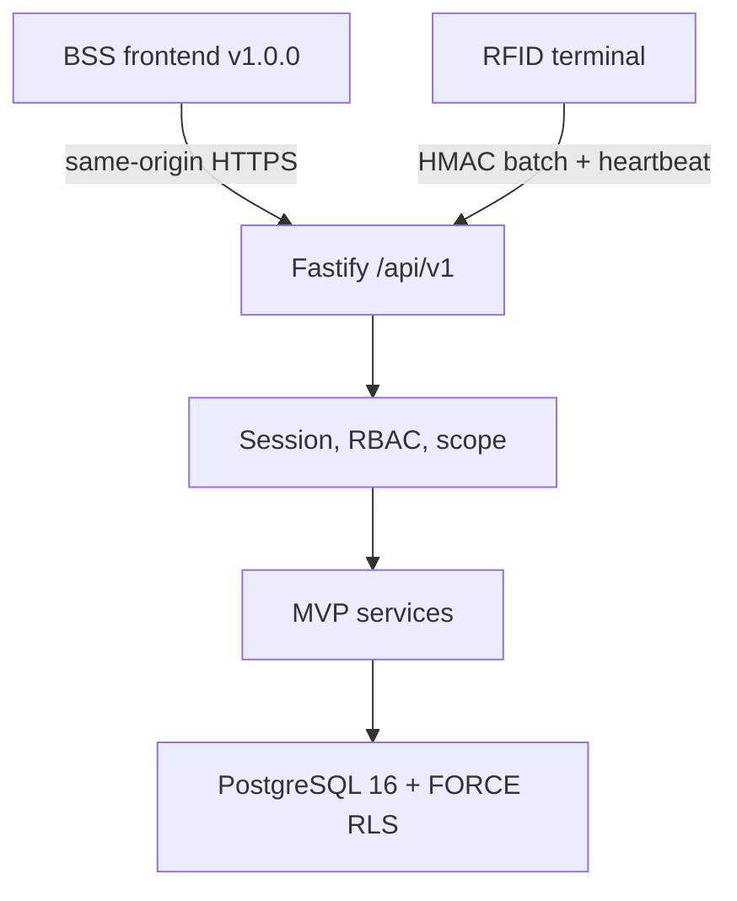
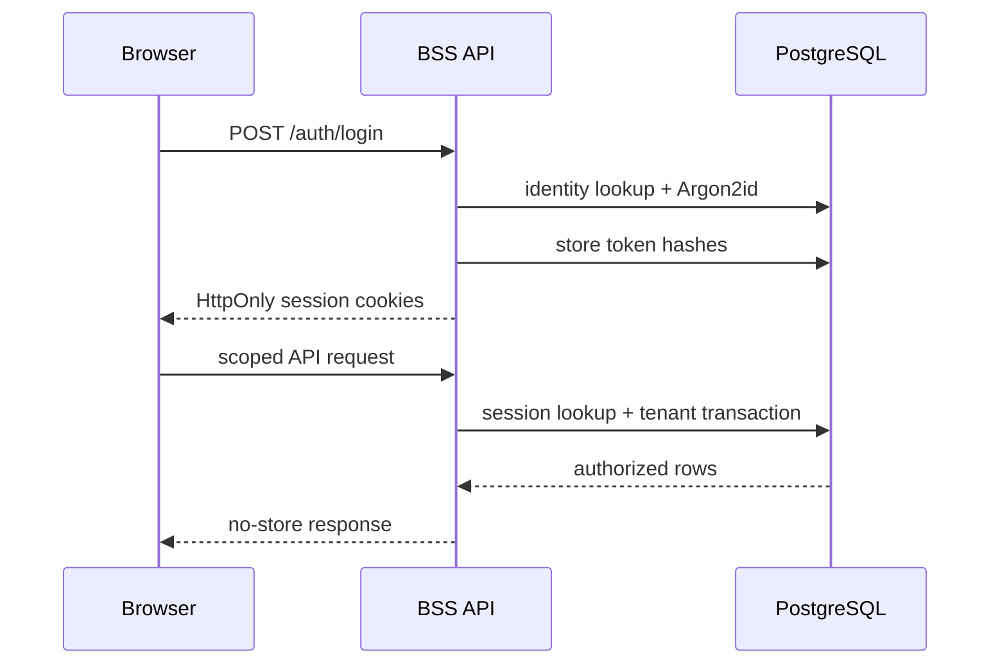

# BSS Backend Architecture – MVP Faza B

| Odluka | Vrijednost |
| --- | --- |
| Stil | modularni monolit |
| Runtime | Node.js 22.9+ / TypeScript / Fastify 5 |
| API | REST `/api/v1`, OpenAPI `1.2.0` |
| Baza | PostgreSQL 16, eksplicitni SQL i `pg` |
| Tenant model | shared schema, `organization_id`, FORCE RLS |
| Sesije | opaque access/refresh tokeni u sigurnim kolačićima |
| Deploy | jedan Node servis za frontend + API; migrator je zaseban korak |

## Sustav

```mermaid
flowchart TD
    UI["BSS frontend v1.0.0"] -->|"same-origin HTTPS"| HTTP["Fastify /api/v1"]
    HTTP --> SEC["Session, RBAC, scope"]
    SEC --> SVC["MVP services"]
    SVC --> PG["PostgreSQL 16 + FORCE RLS"]
    DEV["RFID terminal"] -->|"HMAC batch + heartbeat"| HTTP
```

Modularni monolit zadržava attendance, odluke, audit i izvještaj u jednoj ACID granici. Mikroservisi, queue i objektna pohrana nemaju opravdanje za početni MVP i ostaju zamjenjivi adapteri za kasnije skaliranje.

## Moduli

| Modul | Odgovornost |
| --- | --- |
| `config` | fail-fast environment i produkcijske sigurnosne zabrane |
| `http` | JSON Schema, Origin zaštita, error envelope, cache/security headeri |
| `security` | Argon2id, tokeni, refresh rotacija, RBAC, RFID HMAC, device HMAC/AES-GCM |
| `db` | pool, zajednički transakcijski lifecycle, tenant kontekst, migracije, bootstrap |
| `PgAuthService` | login, invitation accept, session resolve/rotate/logout |
| `PgPhaseAService` | organizacija, workforce, RFID, fond, preview, dashboard |
| `PgMvpService` | evidencija, odluke, terminal ingest, audit i izvozi |
| `PgAttendanceCalculationService` | event-effective konfiguracija, izvedeni attendance dan i eksplicitni ponovni izračun |
| `reports` | CSV, XLSX i PDF iz jedinstvenog preview dataseta |
| `src/adapters/api*` | role-aware frontend hidratacija i stvarne HTTP mutacije |

## Tenant i transakcija

Provjereni `ActorContext` sadrži `organizationId`, `userId`, ulogu, odjele, vlastiti `workerId` i session ID. Za poslovnu operaciju:

1. zajednički `withTransaction` otvara transakciju i jamči rollback/release, uključujući odbacivanje neispravnog pool klijenta;
2. `SET LOCAL` postavlja tenant, actor i request ID;
3. RLS ograničava sve tablice;
4. service dodaje department/self scope;
5. mutacija, revizija i audit završavaju istim commitom ili rollbackom.

Security-definer lookup funkcije koriste se samo prije tenant konteksta za login, session, refresh, invitation i terminal credential. Imaju fiksni `search_path`, RLS isključen samo unutar funkcije i eksplicitne runtime grantove.

## Sesijski protokol

```mermaid
sequenceDiagram
    participant B as Browser
    participant A as BSS API
    participant P as PostgreSQL
    B->>A: POST /auth/login
    A->>P: identity lookup + Argon2id
    A->>P: store token hashes
    A-->>B: HttpOnly session cookies
    B->>A: scoped API request
    A->>P: session lookup + tenant transaction
    P-->>A: authorized rows
    A-->>B: no-store response
```

Refresh se rotira jednom. Ponovna ili konkurentna uporaba istog tokena najprije trajno opoziva aktivnu sesijsku obitelj, a tek zatim vraća 401. Blokirani korisnik ili tenant ne prolazi lookup. Logout je idempotentan, pokušava opoziv preko refresh identiteta i uvijek čisti oba cookieja.

Istekla pozivnica ne zaključava e-mail trajno: dok račun nije aktiviran, novi poziv zaključava i ponovno koristi isti placeholder, opoziva ranije pending tokene i izdaje novi jednokratni token. Aktiviran račun se nikada tiho ne prepisuje.

## Terminalski ingest

Terminal dobiva jednokratnu vjerodajnicu pri pairingu; backend čuva hash i AES-256-GCM ciphertext. Svaki batch/heartbeat nosi device ID, timestamp, nonce i HMAC-SHA-256 canonical request potpis.

Batch se obrađuje serijski po slijedu. Per-tenant transakcijski advisory lock uklanja cross-terminal lock-order deadlock za batch koji sadrži više radnika:

- dupli `deviceEventId` vraća `duplicate`;
- sequence manji ili jednak server cursoru vraća `SEQUENCE_OUT_OF_ORDER`;
- događaj više od pet minuta u budućnosti vraća `EVENT_IN_FUTURE`;
- nepoznata/blokirana kartica vraća odbijeni raw događaj;
- radnikov odjel u trenutku `occurredAt` sprema se kao nepromjenjivi snapshot na raw i sync događaju; zakašnjeli događaj koristi isti event-time interval, a nedokaziv povijesni odjel ostaje `NULL` i nevidljiv Voditelju;
- prijava stvara dan sa snapshotom smjene, vremenske zone, verzije konfiguracije i verzije izračuna;
- odjava računa minute, ali odbija negativno ili dulje od 16 sati;
- prihvaćeni raw događaj nepromjenjivo se povezuje s izvedenim danom;
- raw događaj, sync read model, calculation history i audit su append-only.

Heartbeat ažurira dostupnost i dijagnostiku, ali ne potvrđuje offline red i ne pomiče event cursor.

## Povijesno reproducibilan izračun attendancea

`attendance-v1` odabire organizacijsku IANA vremensku zonu, worker-to-shift assignment i shift definiciju iz intervala `[effective_from, effective_to)` koji sadrži `occurredAt`. Pri prvom prihvaćanju autoritativnog raw događaja jednom razrješava UTC instant u lokalni timestamp i sprema timezone-version ID, korišteni IANA naziv i UTC offset na append-only događaj. Promjena trenutačne zone, smjene, dodjele ili budućih tzdata pravila zato ne mijenja zakašnjeli ni već izvedeni povijesni rezultat. Predmigracijska konfiguracija i lokalna interpretacija se ne pogađaju: takvi zapisi nose `legacy-unversioned / legacy_unavailable`, a operacije koje zahtijevaju povijesnu zonu, interpretaciju ili izvorne događaje fail-closed.

Deterministična pravila v1:

- UTC `occurredAt` uvijek je ulaz; PostgreSQL IANA pretvorba event-effective zone izvršava se točno jednom pri prihvaćanju, a calculation/recalculation i prikaz poslije koriste spremljeni lokalni timestamp i offset bez ponovne tzdata/`Intl` pretvorbe;
- kod noćne smjene (`end <= start`) događaj od lokalne ponoći zaključno s `end` pripada prethodnom poslovnom datumu;
- DST gap ne sintetizira wall-clock unos: sprema se stvarna UTC-izvedena lokalna interpretacija; u foldu kombinacija UTC instanta, lokalnog timestampa i offseta jednoznačno razlikuje prihvaćenu pojavu;
- planirane minute ostaju ugovorne wall-clock minute smjene umanjene za pauzu;
- isti raw događaji, njihove nepromjenjive event-time interpretacije, konfiguracijski snapshot i `attendance-v1` daju isti ugovorni rezultat bez aktualnih timezone pravila.

Prema DEC-024, `POST /attendance/{attendanceDayId}/recalculations` dopušten je samo Administratoru i samo za nezaključano/nefinalno razdoblje. Zahtijeva `If-Match`, podržanu verziju i razlog te odbija svaki postojeći `attendance_month_locks` zapis, odobrenu korekciju ili nepotpunu legacy/event-interpretation provenijenciju. Svaki prolaz dodaje nepromjenjivi calculation zapis sa source event ID-jevima i njihovim lokalnim timestamp/offset dokazom, before/after stanjem, actorom, razlogom, calculation/configuration verzijom, supersession vezom i pogođenim datumom te standardni audit event. Raw događaji se nikad ne mijenjaju. Issue #145 ne otvara razdoblje niti uvodi lifecycle; zasebno upravljani auditirani reopen prije recalculationa/relocka ostaje isključivo u opsegu issuea #146.

## Godišnji i korekcije

Pending i approved godišnji rezerviraju fond. Radni dani računaju se bez vikenda i organizacijskih blagdana. Worker row lock serijalizira konkurentne zahtjeve, a fond se ne može smanjiti ispod postojećih rezervacija ni u jednoj godini. Odluka zahtijeva aktualnu reviziju i manager scope.

Korekcija sprema before/requested snapshot. Odobrenje zaključava zahtjev i izvedeni `attendance_day`, odbija stale snapshot, ponovno provjerava vremensku zonu/16-satnu granicu i mjesečni lock, mijenja samo izvedeni zapis i dodaje audit. `attendance_events` ostaje nepromijenjen.

## Izvještaji

Preview i izvoz koriste isti query servis i isti `datasetVersion`. CSV je UTF-8 BOM + točka-zarez i neutralizira formule. XLSX ima poslovni naslov, filter, frozen header, stilove, hrvatske znakove i kontrolne zbrojeve. PDF koristi ugrađeni Noto Sans i tablični landscape prikaz.

Artefakt, MIME, filename i SHA-256 spremaju se u `report_exports` na 24 sata. To je jednostavan MVP adapter; servis se kasnije može prebaciti na private object storage bez promjene HTTP ugovora.

## Frontend integracija

Fastify može posluživati `dist/` preko `FRONTEND_ROOT`; relativni put se pretvara u apsolutni. SPA i API tada su na istom originu. API adapter:

- pokušava `/me`, a zatim prikazuje login ako nema sesije;
- hidrira samo resurse dopuštene ulozi;
- mapira UUID-e u prikazne identifikatore bez spremanja poslovnog stanja lokalno;
- računa organizacijski “danas” u trenutačnoj tenant zoni, ali terminalski attendance prikaz uzima spremljeni ugovorni lokalni timestamp događaja umjesto ponovne browser `Intl` pretvorbe; correction lifecycle ostaje zaseban;
- šalje `If-Match` za konkurentne mutacije;
- na 401 pokušava jednu refresh rotaciju;
- dijeli jednu refresh rotaciju između konkurentnih 401 odgovora i prekida mrežni zahtjev nakon 20 sekundi;
- preuzima izvještaj iz privatne API rute.

Service worker cacheira samo shell/brand assete. Navigacija je network-first/no-store, a `/api/` uvijek ide izravno na mrežu.

## Granice modularnosti

`PgPhaseAService` i `PgMvpService` namjerno zadržavaju jednu ACID granicu, ali su narasli iznad poželjne veličine modula. Nakon senior pregleda treba ih inkrementalno razdvojiti po workforce, leave, correction, terminal i reporting domenama uz postojeće contract/integration testove. Frontend `app.js` ostaje legacy composition/render modul frozen prikaza. Ni jedno ne opravdava rewrite; aktualni dug i prioriteti navedeni su u `BSS_PRODUCTION_READINESS_AUDIT.md`.

## Migracije i deploy

`001`–`010` su checksumirane i advisory-lockane. Deploy redoslijed je: backup/recovery point, forward migracije, najmanji runtime grantovi, bootstrap samo za novu instalaciju, aplikacija, `/readyz` i smoke. Bootstrap unaprijed generira tenant ID i postavlja RLS kontekst pa radi i s `FORCE RLS` vlasnikom bez superuser ovlasti. Runtime i migrator ne smiju biti ista DB uloga u produkciji.

Migracija `010` dodaje samo novu povijest i nullable raw-link/provenance stupce, uključujući event-effective timezone-version ID/naziv, resolved local timestamp i UTC offset na `attendance_events`. Down migracija je razvojni rollback prije bilježenja novih događaja. Nakon što `010` zabilježi konfiguracijske intervale ili calculation evidence, produkcijski oporavak je forward-only: sačuvati raw i derived/calculation redove, popraviti novu migraciju/aplikaciju i ponovno verificirati. Vraćanje stare aplikacije bez koordinirane podatkovne i sigurnosne analize ponovno bi otvorilo povijesnu nereproducibilnost; brisanje `010` tablica ili novih event-interpretation stupaca uništilo bi dokazni lanac.

Nove history tablice imaju `organization_id`, same-tenant vanjske ključeve i `FORCE RLS`; runtime može izravno dodavati samo append-only calculation redove, dok security-definer triggeri s fiksnim `search_path` zatvaraju i otvaraju konfiguracijske intervale. Efektivni lookup indeksi vode s `(organization_id, entity_id, effective_from DESC, effective_to)`, prihvaćeni raw izvori s `(organization_id, attendance_day_id, occurred_at, id)`, a calculation timeline s `(organization_id, attendance_day_id, created_at DESC, id DESC)`. To podržava event-time odabir i audit bez općeg konfiguracijskog frameworka; reprezentativni query plan/load dokaz ostaje odvojena buduća performance evidencija.

Istekli binarni report artefakti, nonceovi i stare sesije čiste se per-tenant platformskim poslom iz `backend/deploy/maintenance.sql`. Audit i raw evidencijski događaji nisu dio tog čišćenja.

Cloudflare Pages može prikazati samo statički shell. Funkcionalni MVP treba Node/Fastify hosting i PostgreSQL; produkcijska domena se usmjerava na taj same-origin servis ili siguran reverse proxy.

RLS štiti aplikacijske greške i krivi tenant scope, ali nije zamišljen kao obrana od ukradene runtime DB vjerodajnice koja smije slati proizvoljni SQL i `set_config`. Zato su mrežna izolacija, secret rotation i najmanji grantovi obvezni; stroži hostile-credential model zahtijevao bi security-definer DB gateway ili odvojene tenant uloge.

## Namjerne MVP granice

- jedna zadana smjena po radniku, bez višenedjeljnog rostera;
- organizacija se stvara kontrolnim bootstrapom, bez self-service brisanja;
- sinkroni export do 10.000 redaka, bez queuea;
- PostgreSQL bytea storage 24 sata, bez objektnog storagea;
- ručna dostava invitation URL-a, bez e-mail providera;
- bez MFA/SSO/payroll/GPS/biometrije/ERP-a.
